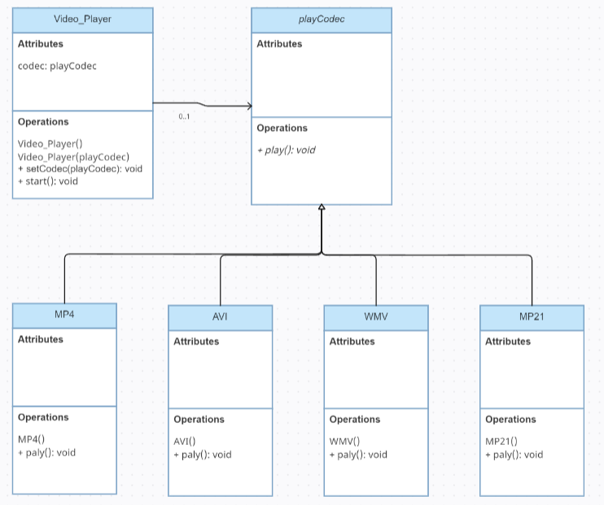
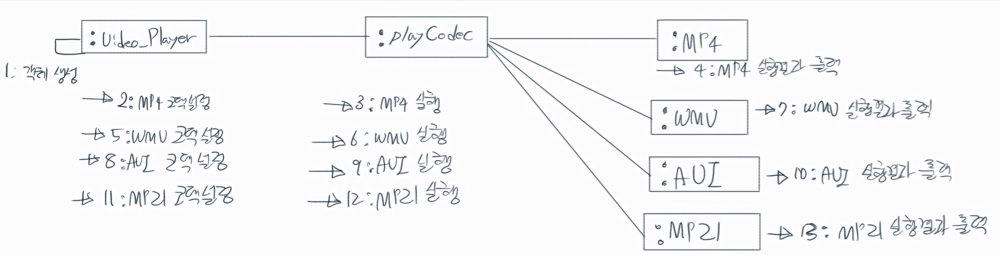

# 개방 폐쇄 원칙

+ 정의: 변경에는 닫혀 있어햐 하고 확장에는 열려 있어야 함
- 설계 방법
  - 계속 변경되는 것을 찾아 상속 구조로 만들어 계속 추가할 수 있도록 한다.
  - 해당 코드에서는 코덱의 종류인 MP4, WMV, AVI, MP21 하나로 묶어 이름을 붙인 playCodec 상위 클래스로 놓고 하위 클래스에서 코덱의 종류를 계속 추가할 수 있도록 한다. 

### 클래스도

### 통신도

